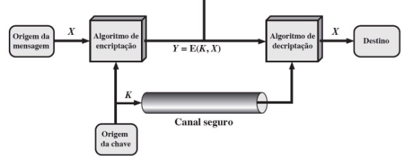
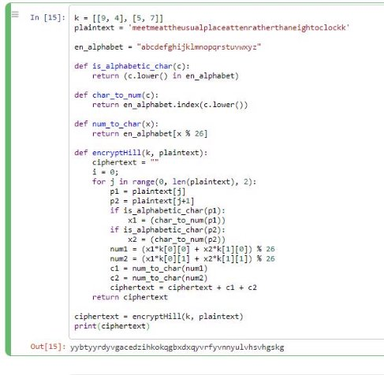
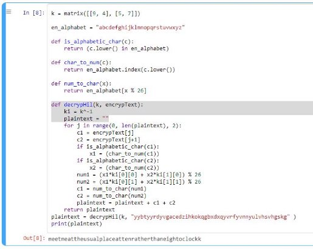

**Universidade Federal do Agreste de Pernambuco**

**Av. Bom Pastor s/n - Boa Vista 55292-270 Garanhuns/PE**

**T +55 (87) 3764-5500**

**m http://www.ufape.edu.br**

**Bacharelado em Ciência da Computação CCMP3079 Segurança de Redes de Computadores**

**Prof. Sérgio Mendonça**

**1ª Verificação de Aprendizagem Para 28/11/2023.**

**Nome Completo:** Jonas Ferreira Leal Junior

1. **Para cada um dos seguintes recursos, determine um nível de impacto baixo, moderado ou alto à perda de confidencialidade, disponibilidade e integridade, respectivamente. Justifique suas respostas.**
1. **uma organização gerenciando informações públicas em seu servidor web.**
- Confidencialidade: Há um baixo impacto da confidencialidade pois se trata de informações públicas.
- Disponibilidade: Há um impacto moderado se for uma informação que tenha um uso constante.
- Integridade: O impacto é da integridade é alto, pois se essa informação é pública, ela pode impactar muitas pessoas e tomadas de decisões. Causando prejuízos em grande escala.
2. **uma organização de aplicação da lei gerindo informações de investigação extremamente sensíveis.**
- Confidencialidade: Há um alto impacto da confidencialidade pois se trata de informações sigilosas, que se vazadas podem comprometer a investigação..
- Disponibilidade: Há um impacto moderado, já que essas informações são acessadas por um grupo restrito de pessoas.
- Integridade: O impacto é da integridade é alto, pois a corrupção dessas informações podem interferir drasticamente no curso da investigação.
3. **uma organização financeira gerindo informações administrativas rotineiras (sem informações relacionadas à privacidade).**
- Confidencialidade: Em caso de informações financeiras de uma organização de capital fechado, há um impacto moderado da confidencialidade pois informações financeiras de uma organização devem ser mantidas restritas apenas às pessoas autorizadas.
- Disponibilidade: Há um impacto moderado, pois se essas informações estiverem indisponíveis em um momento de tomada de decisão, pode levar a adiamentos e perda de prazos.
- Integridade: O impacto é da integridade é alto, pois a corrupção dessas informações podem impactar significativamente no processo de tomada de decisão, causando grandes prejuízos financeiros.
4. **um sistema de informação utilizado para grandes aquisições em uma organização voltada a contratações que contém dados sensíveis da fase de pré-solicitação e dados administrativos rotineiros. avalie o impacto de haver dois conjuntos de dados separadamente e o sistema de informação único.**
- Confidencialidade: Há um alto impacto, pois informações desse tipo devem ser mantidas confidenciais, sendo reveladas somente as partes interessadas na transação.
- Disponibilidade: Há um alto impacto, pois se essas informações são cruciais para tomada de decisão e fechamento de alguma proposta.
- Integridade: O impacto é da integridade é alto, pois a corrupção dessas informações podem impactar significativamente no processo de tomada de decisão, causando grandes prejuízos financeiros.
5. **uma indústria de energia contém um sistema SCada (controle supervisório e aquisição de dados, do acrônimo em inglês para supervisory control and data acquisition) controlando a distribuição da energia elétrica para uma grande instalação militar. o sistema SCada contém tanto sensores de dados em tempo real quanto informações das rotinas administrativas. avalie o impacto de haver dois conjuntos de dados separadamente e o sistema de informação único.**
- Confidencialidade: Há um alto impacto, pois por se tratar de informações sobre uma instalação militar, a confidencialidade é um fator muito importante.
- Disponibilidade: Há um alto impacto, pois se a informações para tomada de decisão em tempo real, a indisponibilidade, mesmo que por um pequeno período de tempo pode levar a problemas em grandes escalas.
- Integridade: O impacto é da integridade é alto, pois a corrupção dessas informações tem um impacto muito significativo na tomada de decisão.
2. **Responda, explique com exemplos, as questões abaixo:**
1. **Quais são os elementos essenciais de uma cifra simétrica? Explique-as.**
- Texto claro é a mensagem original que se deseja proteger;
- Algoritmo de encriptação são os passos que o texto claro irá ser submetido para a transformação em texto cifrado.
- Chave é uma sequência de bytes que deve ser mantida secreta, pois será utilizada na encriptação/decriptação para obter-se o resultado desejado, seja
  - texto claro correto na decriptação ou o texto criptografado correto no caso da encriptação.
- Texto cifrado é o texto claro após as transformações do algoritmo junto com a chave, o resultado é um texto que não deve ser possível interpretar sem a decriptação.
- Algoritmo de decriptação são os passos que o texto criptografado irá passar para a obtenção do mesmo texto claro do início que foi originalmente encriptador.
2. **Quais são as duas funções básicas usadas nos algoritmos de encriptação? Explique-as.**
- Criptografia: É a operação de transformar um texto claro em um texto cifrado por meio de procedimentos e uma ou mais chaves que serão utilizadas para obter novamente a mensagem original.
- Decriptografia: É a operação inversa a criptografia, que por meio dos procedimentos específicos da técnica de criptografia utilizada e das chaves utilizadas, transformam o texto cifrado de volta na mensagem original.
3. **Quantas chaves são necessárias para duas pessoas se comunicarem por meio de uma cifra?**

   **Explique-as, demonstrando, você pode se utilizar de gráficos ou desenhos.**

Apenas uma chave é necessária, pois esta será transmitida por um canal seguro entre a origem e destinatário da mensagem, de maneira que será possível transmitir a mensagem criptografada por um canal com menor segurança, e no destino decriptar a mensagem com a chave que foi trocada.

4. **Quais são as duas técnicas gerais para atacar uma cifra? Explique-as.**
- Criptoanálise: que consiste em usar o conhecimento do algoritmo em questão e de outros algoritmos existentes, junto com pares de texto claro/criptografado e estatísticas da linguagem do texto claro para tentar inferir qual é a mensagem criptografada
- Força bruta: Tentar insistentemente por meio de dicionários ou geradores de chave, até obter um texto legível.
5. **Defina resumidamente a cifra de César; a cifra de Hill; a cifra de Feistel (por que é importante estudá-la?); e, a diferença entre DES, Rijndael e AES.**
- **Cifra de César:** Consiste em rotacionar o alfabeto em três posições, com isso ‘a’ letra a se tornara ‘c’ e todas as demais seguem o mesmo padrão.
- **Cifra de Hill:** É uma cifra que faz criptografa M letras de uma vez, a chave é organizada em um formato de matriz e tem tamanho M x M, o processo de criptografia consiste em converter os caracteres para números correspondentes e multiplicar as matrizes depois fazer modulado pelo número de caracteres contido no alfabeto utilizado.
- **Cifra de Feistel**: É uma criptografia de bloco que usa o método de substituição e permutação junto com a execução de múltiplas rodadas de encriptação com múltiplas chaves que são geradas a partir a chave principal, esses procedimentos são responsáveis por aumentar drasticamente a segurança dessa criptografia. É importante estudá-la porque ela traz os conceitos de difusão e confusão que tem o objetivo de frustrar a criptoanálise
- **Rijndael**: O algoritmo Rijndael é mais genérico e pode ser configurado com diferentes tamanhos de bloco e chave.
- **AES**: É uma implementação específica do Rijndael, com uma configuração fixa de bloco de 128 bits e suporte para chaves de 128 bits com 10 rodadas, 192 bits 12 rodadas ou 256 bits com 14 rodadas.
- **DES:** Utiliza bloco de 64 bits, 16 rodadas de criptografia com chave de 56 bits
3. **Quando o barco de patrulha norte-americano PT-109, sob o comando do tenente John f. Kennedy, foi afundado por um destróier japonês, uma mensagem foi recebida na estação sem fio australiana em código playfair:**

   **KXJEY UREBE ZWEHE WRYTU HEYFS KREHE GOYFI WTTTU OLKSY CAJPO BOTEI ZONTX BYBNT GONEY CUZWR GDSON SXBOU YWRHE BAAHY USEDQ**

**a chave usada foi royal new zealand navy. decripte a mensagem. traduza TT para tt.**

Texto claro:

pt boat one owe nine lost in action in blackett strait two miles sw meresu cove crew of twelve request any information

Tradução:

barco pt um deve nove perdido em combate no estreito de blackett duas milhas sw meresu cove tripulação de doze pessoas solicita qualquer informação

4. **Crie uma aplicação que possa encriptar e decriptar usando uma cifra de Hill 2*×*2.**

**def is\_alphabetic\_char(c):**

**return (c.lower() in en\_alphabet) def char\_to\_num(c):**

**return en\_alphabet.index(c.lower()) def num\_to\_char(x):**

**return en\_alphabet[x % 26]**

**k = [[9, 4], [5, 7]]**

**plaintext = 'meetmeattheusualplaceattenratherthaneightoclockk'**

**en\_alphabet = "abcdefghijklmnopqrstuvwxyz"**

**def is\_alphabetic\_char(c):**

**return (c.lower() in en\_alphabet)**

**def char\_to\_num(c):**

**return en\_alphabet.index(c.lower())**

**def num\_to\_char(x):**

**return en\_alphabet[x % 26]**

**def encryptHill(k, plaintext):**

**ciphertext = ""**

**i = 0;**

**for j in range(0, len(plaintext), 2):**

**p1 = plaintext[j]**

**p2 = plaintext[j+1]**

**if is\_alphabetic\_char(p1):**

**x1 = (char\_to\_num(p1))**

**if is\_alphabetic\_char(p2):**

**x2 = (char\_to\_num(p2))**

**num1 = (x1\*k[0][0] + x2\*k[1][0]) % 26 num2 = (x1\*k[0][1] + x2\*k[1][1]) % 26 c1 = num\_to\_char(num1)**

**c2 = num\_to\_char(num2)**

**ciphertext = ciphertext + c1 + c2 return ciphertext**

**ciphertext = encryptHill(k, plaintext)**

**print(ciphertext)**

**k = matrix([[9, 4], [5, 7]])**

**en\_alphabet = "abcdefghijklmnopqrstuvwxyz"**

**def is\_alphabetic\_char(c):**

**return (c.lower() in en\_alphabet)**

**def char\_to\_num(c):**

**return en\_alphabet.index(c.lower())**

**def num\_to\_char(x):**

**return en\_alphabet[x % 26]**

**def decrypHil(k, encrypText):**

**ki = k^-1**

**plaintext = ""**

**for j in range(0, len(encrypText), 2):**

**c1 = encrypText[j]**

**c2 = encrypText[j+1]**

**if is\_alphabetic\_char(c1):**

**x1 = (char\_to\_num(c1))**

**if is\_alphabetic\_char(c2):**

**x2 = (char\_to\_num(c2))**

**num1 = (x1\*ki[0][0] + x2\*ki[1][0]) % 26 num2 = (x1\*ki[0][1] + x2\*ki[1][1]) % 26 c1 = num\_to\_char(num1)**

**c2 = num\_to\_char(num2)**

**plaintext = plaintext + c1 + c2**

**return plaintext**

**plaintext = decrypHil(k, "yybtyyrdyvgacedzihkokqgbxdxqyvrfyvnnyulvhsvhgskg" ) print(plaintext)**

5. **Responda, resumidamente, as questões a seguir:**
1. **Qual é a diferença entre uma cifra de bloco e uma cifra de fluxo?**

   A cifra de bloco processa um conjunto de bytes de uma vez, retornando uma saída para bloco, já uma cifra de fluxo irá processar byte a byte.

2. **O que é uma cifra de produto?**

   A cifra de produto foi proposta por Feistel como uma forma de aumentar a segurança da criptografia por meio da execução de duas ou mais sequências de cifragem, de forma que o produto final será mais seguro do que qualquer uma das técnicas isoladamente.

3. **Qual é a diferença entre difusão e confusão? Explique.**

   A difusão é a propriedade que uma criptografia tem de que cada caractere do texto claro afeta muitos outros do texto criptografado, com o intuito de dissipar as estatísticas da linguagem, dificultando a criptoanálise

A confusão procura estabelecer uma relação entre as estatísticas do texto cifrado com a chave usada, com o intuito de dificultar a descoberta da chave utilizada.

4. **Quais parâmetros e escolhas de projeto determinam o algoritmo real de uma cifra de Feistel?**
- Tamanho do bloco;
- Tamanho da chave;
- Número de rodadas;
- Algoritmo de geração da subchave;
- Função F;
5. **Explique o efeito avalanche.**

   É uma propriedade que uma pequena mudança no texto claro ou na chave produz uma alteração significativa no texto cifrado. Esse efeito é uma característica do DES. Uma mudança em um bit do texto claro ou um bit da chave deverá produzir uma modificação em muitos bits do texto cifrado.

6. **Encontre o inverso multiplicativo de cada elemento diferente de zero em Z5**

   Na definição de anel infinito encontra-se o inverso multiplicativo b de um elemento a quando:

A \* B ≡ 1 mod n. Como está sendo pedido para Z5, então n = 5:

1 \* 1 mod 5 ≡ 1 2 \* 3 mod 5 ≡ 1 3 \* 2 mod 5 ≡ 1

4 \* 4 mod 5 ≡ 1 {1, 2, 3, 4}

7. **Para a aritmética de polinômios com coeficientes em Z10, realize os seguintes cálculos:**
- (7x + 2) − (x² + 5)
  - 7x + 2 -x² -5
  - -x² + 7x - 3
- (6x² + x + 3) × (5x² + 2)

30x4+ 12x² + 5x³ + 2x + 15x² + 6 30x4+ 5x³ + 27x² + 2x + 6

8. **Use a chave 1010 0111 0011 1011 para encriptar o texto claro "ok"conforme expresso em ASCII, ou seja, 0110 1111 0110 1011. Os projetistas do S-AES obtiveram o texto cifrado 0000 0111 0011 1000. E você?**

   O S-AES utiliza do mesmo algoritmo do AES, porém mais simplificado. A principal diferença é que na simplificação a chave utilizada contém 16 bits, o número de rodadas é 2 e na segunda rodada não deve ocorrer o Mix Columns, como mostra a figura:

Utilizando a chave 1010 0111 0011 1011 para encriptar 0110 1111 0110 101 (ok), segue a utilização do S-AES:

9. **Compare AES com DES. Para cada um dos seguintes elementos do DES, indique o elemento comparável no AES ou explique por que ele não é necessário no AES.**
1. **XOR do material da subchave com a entrada da função f.**
   1. **DES**: as subchaves são derivadas da principal usando permutações e rotações. Antes de ser usada na rodada, as subchaves são expandidas e combinadas com a metade direita do bloco por XOR.
   1. **AES**: cada subchave de rodada deriva diretamente da chave principal. A adição de subchaves acontece por XOR com cada palavra de estado em cada rodada.
1. **XOR da saída da função f com a metade esquerda do bloco.**
   1. **DES**: depois que ocorre a função F, antes de seguir para a rodada seguinte, a saída é combinada por XOR com a metade esquerda do bloco.
   1. **AES**: a saída da função de mixColumns é combinada com o estado por XOR antes de passar para a próxima rodada.
1. **função f.**
   1. **DES**: a função F envolve expansão, permutações, substituições e XORs para misturar os dados.
   1. **AES**: a função MixColumns parecida com a função F, envolve operações para combinar estados.
1. **permutação P.**
   1. **DES**: a permutação P é usada no final da função F misturarando bits.
   1. **AES**: não há uma permutação P específica. A mistura e difusão são alcançadas por meio de várias operações, incluindo ShiftRows e MixColumns.
1. **troca de metades do bloco.**
- **DES**: após cada rodada, as metades esquerda e direita do bloco são trocadas.
- **AES**: ao invés de troca específica das metades do bloco, o estado é manipulado com operações específicas em cada rodada.
10. **Calcule a saída da transformação MixColumns para a seguinte sequência de bytes de entrada "67 89 AB CD". Aplique a transformação InvMixColumns ao resultado obtido para verificar seus cálculos. Altere o primeiro byte da entrada de "67"para "77", realize a transformação MixColumns novamente para a nova entrada e determine quantos bits mudaram na saída.**

    **Nota: você pode realizar todos os cálculos à mão ou escrever um programa que dê suporte a eles. Se escolher escrever um programa, ele deverá ser feito inteiramente por você; nesta tarefa, não use bibliotecas ou código fonte de domínio público (você pode se guiar pelos exemplos Sage disponibilizados).**

5 bits foram alterados.
