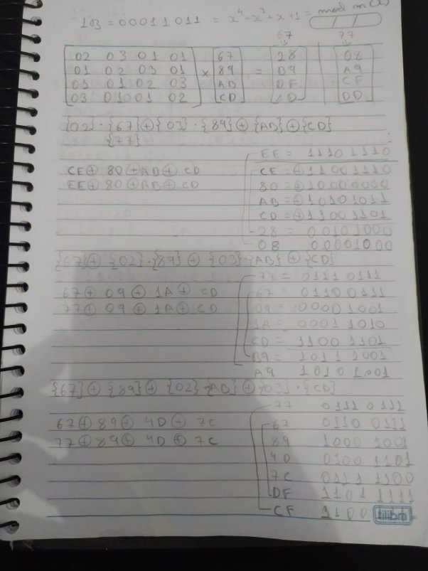
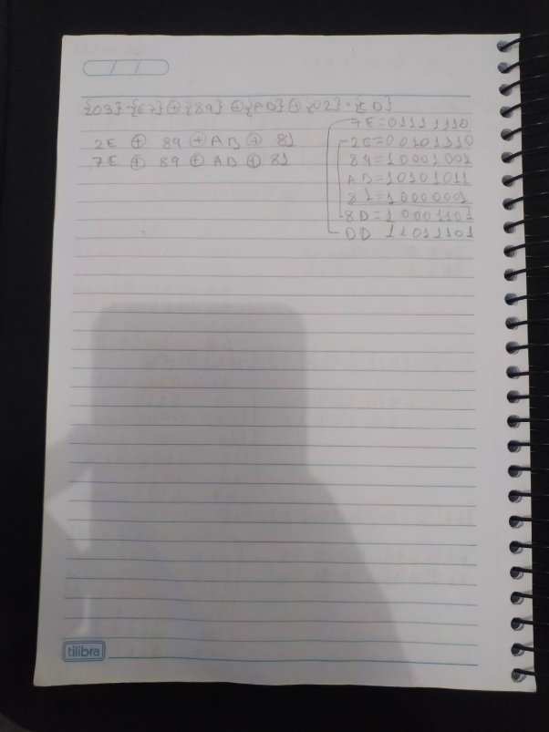

**Nome Completo:**

- Izabel Yale Neves Nascimento
- Jonas Ferreira Leal Junior

**Questões retiradas do livro-texto da disciplina.**

**Conforme conversamos em sala de aula, as atividades devem ser realizadas para apresentação e discussão em sala, sempre nas aulas das quintas-feiras, atribuindo ao estudante uma nota de 0 ou 1 por cada atividade realizada e apresentada.**

1. **Qual foi o conjunto original de critérios usados pelo NIST para avaliar as cifras AES candidatas?**

Os critérios originais foram: Segurança Criptográfica, Eficiência Computacional, Viabilidade de Implementação, Flexibilidade e Adaptabilidade e Avaliação Pública e Aceitação.

2. **Qual foi o conjunto final de critérios usados pelo NIST para avaliar as cifras AES candidatas?**

Os critérios finais se baseiam nos originais, porém não foram seguidos ao pé da letra. Utilizou-se de feedbacks das cifras candidatas e as que transpareciam mais confiança e segurança.

3. **Qual é a diferença entre Rijndael e AES?**
- **Rijndael**: O algoritmo Rijndael é mais genérico e pode ser configurado com diferentes tamanhos de bloco e chave.
- **AES**: É uma implementação específica do Rijndael, com uma configuração fixa de bloco de 128 bits e suporte para chaves de 128, 192 ou 256 bits.
4. **Responda:**
1) **Qual é a finalidade do array Estado?**

É uma matriz 4x4 de bytes onde cada um desses elementos é um byte, usada no AES

para representar blocos durante as várias etapas do algoritmo. Durante as fases do algoritmo, os bytes na matriz de estado são manipulados pelas operações: SubBytes, ShiftRows, MixColumns, e AddRoundKey.

2) **Como é construída a S-box?**

A S-box é uma tabela de substituição do AES que substitui cada byte de entrada por outro

byte de acordo com uma tabela predefinida. Para construí-las aplica-se em cada byte da S-box:

- **Inverso em GF(2^8)**: é substituído pelo seu inverso multiplicativo em um campo finito GF(2^8).
- **Adição de uma constante**: Uma constante específica (0x63 em hexadecimal) é adicionada.
- **Aplicação de Transformações Afine e Lineare**s: Operações de substituição são aplicadas..
3) **Descreva rapidamente o estágio SubBytes, ShiftRows, MixColumns, AddRoundKey, e o algoritmo de expansão de chave.**

**SubBytes:** utiliza uma S-box para realizar uma substituição byte a byte do bloco **ShiftRows:** uma permutação simples

**MixColumns:** uma substituição que utiliza aritmética sobre GF(28)

**AddRoundKey:** um XOR bit a bit simples do bloco atual com uma parte da chave expandida

5. **Quantos bytes em Estado são afetados por ShiftRows?**

No ShiftRows alguns bytes são afetados durante as trocas, são eles:

Na segunda linha, é realizado um deslocamento circular à esquerda por 1 byte. Na terceira linha, é feito um deslocamento circular à esquerda por 2 bytes. Na quarta linha, ocorre um deslocamento circular à esquerda por 3 bytes

6. **Use a chave 1010 0111 0011 1011 para encriptar o texto claro "ok"conforme expresso em ASCII, ou seja, 0110 1111 0110 1011. Os projetistas do S-AES obtiveram o texto cifrado 0000 0111 0011 1000. E você?**

O S-AES utiliza do mesmo algoritmo do AES, porém mais simplificado. A principal diferença é que na simplificação a chave utilizada contém 16 bits, o número de rodadas é 2 e na segunda rodada não deve ocorrer o Mix Columns, como mostra a figura:

 

Utilizando a chave 1010 0111 0011 1011 para encriptar 0110 1111 0110 101 (ok), segue a utilização do S-AES:

7. **Compare AES com DES. Para cada um dos seguintes elementos do DES, indique o elemento comparável no AES ou explique por que ele não é necessário no AES.**
1) **XOR do material da subchave com a entrada da função f.**
- **DES**: as subchaves são derivadas da principal usando permutações e rotações. Antes de ser usada na rodada, as subchaves são expandidas e combinadas com a metade direita do bloco por XOR.
- **AES**: cada subchave de rodada deriva diretamente da chave principal. A adição de subchaves acontece por XOR com cada palavra de estado em cada rodada.
2) **XOR da saída da função f com a metade esquerda do bloco.**
- **DES**: depois que ocorre a função F, antes de seguir para a rodada seguinte, a saída é combinada por XOR com a metade esquerda do bloco.
- **AES**: a saída da função de mixColumns é combinada com o estado por XOR antes de passar para a próxima rodada.
3) **função f.**
- **DES**: a função F envolve expansão, permutações, substituições e XORs para misturar os dados.
- **AES**: a função MixColumns parecida com a função F, envolve operações para combinar estados.
4) **permutação P.**
- **DES**: a permutação P é usada no final da função F misturarando bits.
- **AES**: não há uma permutação P específica. A mistura e difusão são alcançadas por meio de várias operações, incluindo ShiftRows e MixColumns.
5) **troca de metades do bloco.**
- **DES**: após cada rodada, as metades esquerda e direita do bloco são trocadas.
- **AES**: ao invés de troca específica das metades do bloco, o estado é manipulado com operações específicas em cada rodada.
8. **(1 ponto-extra) Calcule a saída da transformação MixColumns para a seguinte sequência de bytes de entrada "67 89 AB CD". Aplique a transformação InvMixColumns ao resultado obtido para verificar seus cálculos. Altere o primeiro byte da entrada de "67"para "77", realize a transformação MixColumns novamente para a nova entrada e determine quantos bits mudaram na saída.**

   **Nota: você pode realizar todos os cálculos à mão ou escrever um programa que dê suporte a eles. Se escolher escrever um programa, ele deverá ser feito inteiramente por você; nesta tarefa, não use bibliotecas ou código fonte de domínio público (você pode se guiar pelos exemplos Sage disponibilizados).**

5 bits foram alterados.

9. **(2 pontos-extra) Crie um software que possa encriptar e decriptar usando S-AES. Dados de teste: um texto claro binário de 0110 1111 0110 1011 encriptado com uma chave binária de 1010 0111 0011 1011 deverá dar o texto cifrado binário 0000 0111 0011 1000. A decriptação deverá funcionar da mesma forma.**
